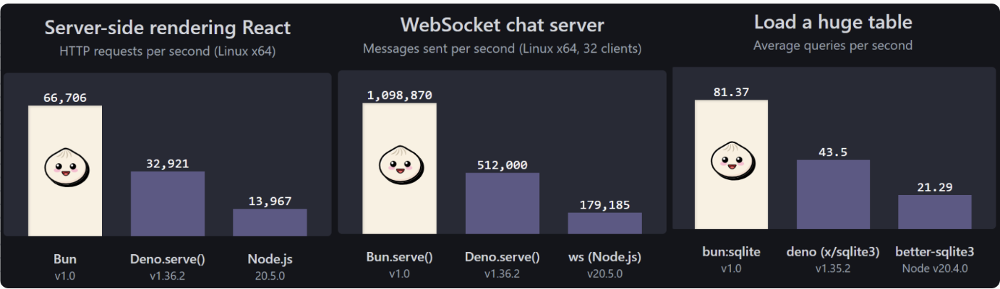
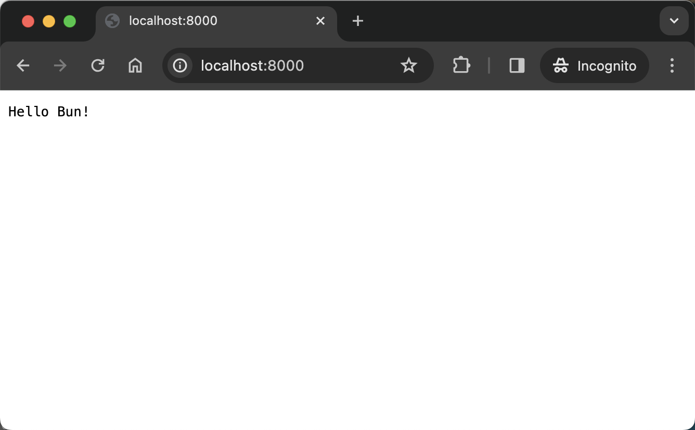
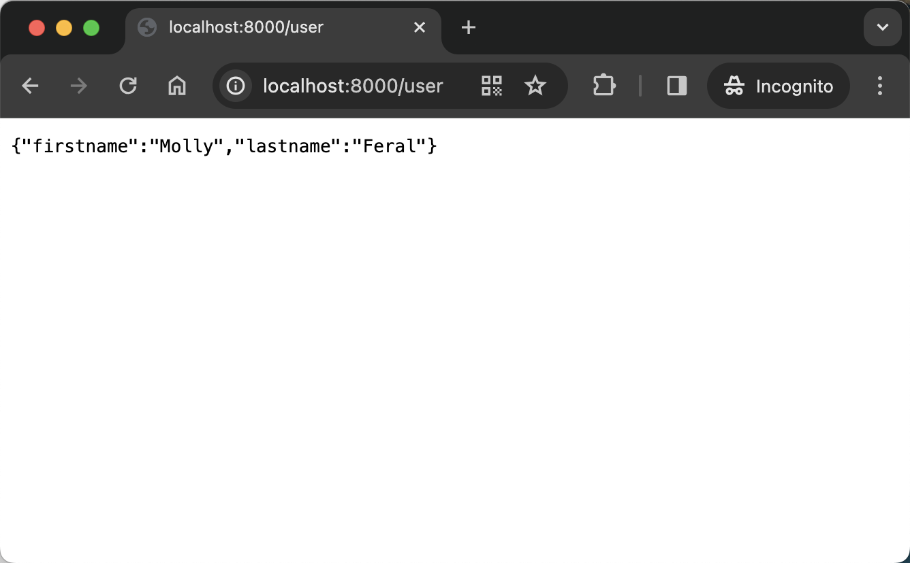

# Build your first Web Application with Bun

## Outline

- [What is Bun](#what-is-bun)
  - [Why use Bun](#why-use-bun)
- [Build an HTTP server](#build-an-http-server)
  - [Step 1: Initiate a Bun project](#step-1-initiate-a-bun-project)
  - [Step 2: Create an HTTP server](#step-2-create-an-http-server)
  - [Step 3: Add routers](#step-3-add-routers)
  - [Step 4: Connect to database](#step-4-connect-to-database)
  - [Bun vs Node.js](#bun-vs-nodejs)
- [Build an React App](#react-app-example)
- [Convert existing projects to use Bun](#how-to-convert-your-existing-projects-to-use-bun)
- [Run test with Bun](#example-for-bun-test-)
- [Limitations and Challenges](#limitations-and-challenges)

<br/>


## What is Bun?
---
Bun is a Javascript runtime and comprehensive toolkit that simplifies development. 

### Why use Bun?
```
Bun is a JavaScript runtime that's disrupting the dominance of Node.js and Deno by simplifying complexity while boosting speed. It ditches the standard V8 engine in favor of JavaScriptCore from Apple's Safari browser, resulting in a significant performance upgrade.
```


```
Moreover, Bun isn't just a runtime—it's an all-in-one toolkit. With features like a bundler, transpiler, task runner, and package management, it eliminates the need for juggling multiple tools. It seamlessly integrates with TypeScript projects, treating them as first-class citizens without requiring external dependencies like with Node.js. Similarly, Bun includes support for testing with Jest, as well as bundling and transpilation functionalities, all without the need for additional installations. This consolidation marks a step towards a future where a single tool can handle entire projects effortlessly.

And the best part? It seamlessly replaces Node.js, maintaining compatibility with familiar Node APIs and npm packages. Whether you're running servers or handling passwords, Bun has you covered—all within one tidy package.

```
## Installation
---
Bun ships as a single executable code that can be installed in the following ways:

 ### MacOS/Linux (curl)
 ```shell
 $ curl -fsSL https://bun.sh/install | bash # for macOS, Linux, and WSL
  # to install a specific version
 $ curl -fsSL https://bun.sh/install | bash -s "bun-v1.0.0"
 ```

 ### Windows (cmd.exe)
 ---
 Keep note that Bun requires a minimum of Windows 10 version 1809
 ```shell
 $ powershell -c "irm bun.sh/install.ps1|iex"
 ```

 ### Docker
 ```shell
 $ docker pull oven/bun
 $ docker run --rm --init --ulimit memlock=-1:-1 oven/bun
```


### Ensure Installation
```shell
$ bun --version
```

<br/>

## Build an HTTP server

---

A backend HTTP server manages your data and provides APIs for frontend services.  

### Step 1: Initiate a Bun project

---

Create a new folder for your server code: `mkdir server`. Then, inside the folder, execute `bun init`.
During initialization, you'll see the following prompt:

```shell
$ bun init
bun init helps you get started with a minimal project and tries to guess sensible defaults. Press ^C anytime to quit

package name (server): 
entry point (index.ts):
```
By default, Bun will set the entry point of your server as `index.ts`. To use pure JavaScript, you can specify your own entry point file, `server.js` for example.

`bun init` generates the following files:
```shell
 + server.js (the specified entry file)
 + jsconfig.json (for editor auto-complete)
 + package.json (project metadata: dependencies, scripts, configuration, etc)
 + README.md (instructions for starting the server)
 + .gitignore
```

### Step 2: Create an HTTP server

---

Inside `server.js`, we use the function `serve` implemented on the `Bun` global object to create a server.

```javascript
Bun.serve({
    fetch(req) {
        return new Response("Hello Bun!");
    },
    port: 8000
});
```
`Bun.serve` takes in a `fetch` handler as global request handler. It receives a [Request](https://developer.mozilla.org/en-US/docs/Web/API/Request) object and returns a [Response](https://developer.mozilla.org/en-US/docs/Web/API/Response).

By default, the server listens at port 3000. You can use the `port` option to specify a different port. More initialization options can be found [here](https://bun.sh/docs/api/http#reference).

To start the server, run `bun run server.js`. Then, you can access it at address `http://localhost:port`.
You can also add the start script to `package.json`, then you can run the server via `bun start`.
```json
{
  ...
  "scripts": {
    "start": "bun run server.js"
  },
  ...
}
```

### Step 3: Add routers

---

Usually, we'll need different urls for multiple APIs. `Bun` provides the [`bun-serve-router`](https://socket.dev/npm/package/bun-serve-router) package for that. 

To use `bun-server-router`, add the dependency:
```shell
bun add bun-serve-router
```

Then, import `Router` and add your routes:
```javascript
import { Router } from "bun-serve-router";

const router = new Router();

router.add("GET", "/", (request, params) => {
    return new Response("Hello Bun!");
})

router.add("GET", "/user", (request, params) => {
    let userinfo = {"firstname": "Molly", "lastname": "Feral" }
    return new Response(JSON.stringify(userinfo));
})
```
Here we created a `Router` object and then added two routes to it using `router.add`. The route `/` returns a string `Hello Bun!`, route `/user` returns a JSON object.

To make the router work, we need to update our `serve` code:
```javascript
Bun.serve({
    async fetch(req) {
        const response = await router.match(req);
        if (response) {
            return response
        } else {
            throw new Error("woops!");
        }
    },
    port: 8000
});
```
Inside the fetch handler, we use `router.match()` to deliver requests based on URLs. There's a chance that a requested URL can not be 
served. So we need to check if we get a valid response. If response is `undefined`, throw an error, or return a customized error message.

Now you can see different responses when requesting for different URLs:

<div style="display:inline-block">
  
  
</div>

### Step 4: Connect to Database

---

Several database drivers work in Bun due to the compatibility with `node:tls` and `node:net` since Bun v0.5, 
including [Postgres.js](https://github.com/porsager/postgres), [mysql2](https://github.com/sidorares/node-mysql2), [node-redis](https://github.com/redis/node-redis),
[Mongoose](https://mongoosejs.com/docs/), and others.
You can use them in Bun projects as in Node.js projects.

Bun also natively implements a [SQLite3](https://www.sqlite.org/) driver. You can refer to [the official document](https://bun.sh/docs/api/sqlite) for more information.

Here, we want to show an example of connecting to MongoDB using [`Mongoose`](https://mongoosejs.com/docs/index.html).

First, add Mongoose as a dependency:
```shell
$ bun add mongoose
```

Then, import mongoose and play with it:
```javascript
import * as mongoose from 'mongoose';
```

Everything in Mongoose starts with a [Schema](https://mongoosejs.com/docs/guide.html). It maps to a MongoDB collection and specifies the shape of its documents. 
You can define a schema using `mongoose.Schema`. To use the defined Schema, you then need to convert it to a data model using the `mongoose.model` API.

Here, we defined a `cardSchema` with two properties `front` and `back`, then converted it to a Mongoose Model `Card`.
```javascript

// define schema
const cardSchema = new mongoose.Schema({
    front: String,
    back: String,
});

const Card = mongoose.model('Card', cardSchema);
```

After having the Schema, you can connect to database and manipulate your data.

```javascript
// connect to database
await mongoose.connect('your_mongodb_connection_string');

// insert a card
const card = new Card({front: "front", back: "back"});
await card.save();

// get cards from db
const cards = await Card.find();
console.log(cards);
```

The previous code connects to the MongoDB server, inserts a new card using `model.save()` API, then pulls all cards from server using 
`model.find()` API. Let's say the previous code is located in a file named `db.js`. You can run it via `bun run db.js`. The first time 
you run it, you should see output in console like this:

```shell
[
  {
    _id: new ObjectId('660f25552bf7c196d9f2d2be'),
    front: "front",
    back: "back",
    __v: 0,
  }
]

```

Finally, you can call `mongoose.disconnect()` to close a connection.

### Bun vs Node.js

---

As you can see, writing a Bun HTTP server is similar to writing a Node.js one. Why do we bother learning a new tool? 

The key answer is performance. According to the [official document](https://bun.sh/docs/api/http#benchmarks), 
the `Bun.serve` server can handle roughly 2.5x more requests per second than Node.js on Linux.

Besides, Node.js is a pure JavaScript runtime, you need external dependencies to get Typescript support, npm for package management, as well as 
third-party tools like Webpack for bundling. While Bun aims to provide an all-in-one JavaScript toolkit. It has First-Class TypeScript support, 
a fast built-in package manager([`bun install`](https://bun.sh/docs/cli/install), `bun add`, `bun remove`, etc) , an easy-to-use bundler [`Bun.build`](https://bun.sh/docs/bundler), and a Jest-compatible test runner
[`bun test`](https://bun.sh/docs/cli/test). It can relieve you from the complex, fragmented toolchains common today.


<br/>

## React App Example

## How to convert your existing projects to use Bun

## Example for Bun test ?

## Limitations and Challenges

```
A tech share for Bun js
```
